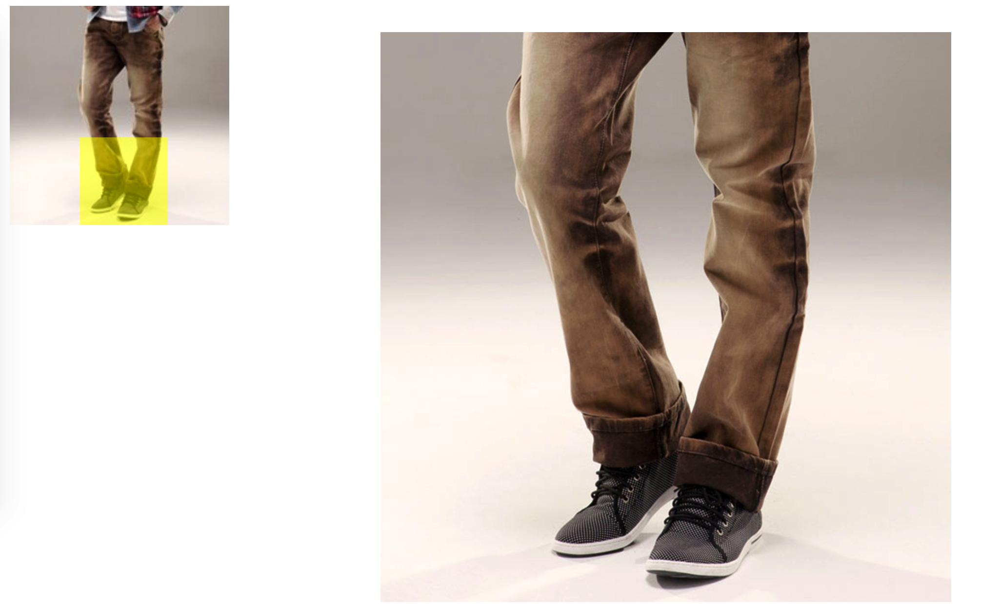

# Magnifying
## 效果图:
放大镜效果,封装成插件,效果图如下:
 
## 使用:
使用起来非常简单,可以根据自己的实际需要进行定制.使用方法如下:
### CSS
````
<link rel="stylesheet" href="style.css">
````
### html:
小图 (待放大的图)
````
<div class="wrap">
    
    <span class="hander"></span>
    <div class="mark"></div>
</div>
````
大图:(大图)
````
<div class="big-wrap">
    
</div>
````
### JS
````
    <script src="Magnifying.js"></script>
    window.onload= function(){
        var m = new Magnifying();
        var settings = {
            // 可选参数,如果不传,则按照默认
            w:250,//小图宽度
            h:250,//小图高度
            bw:650,//大图宽度
            bh:650,//大图高度
            // 必填参数
            wrap:'wrap',
            hander:'hander',
            bigWrap:'big-wrap',
            bigImg:'big-img',
            mark:'mark'
        };
        m.init(settings);
    }
````
    
